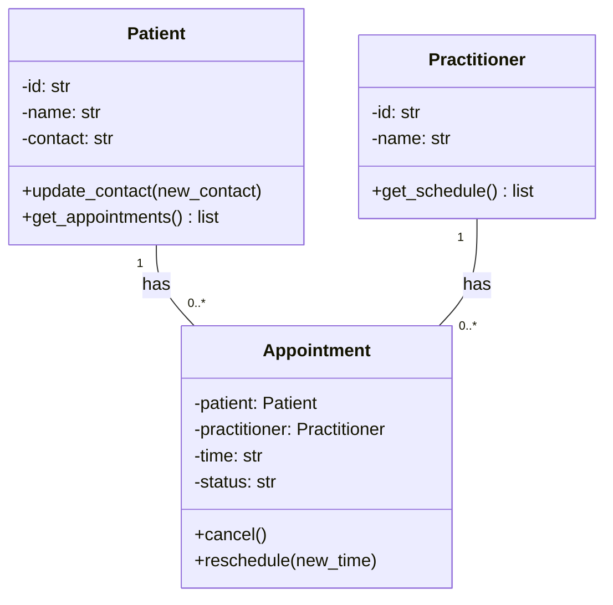

# SmartCare Domain Model v0.3

## A. Requirements Review — Nouns, Verbs, Business Rules

**Nouns (candidate concepts):** patient, practitioner, appointment,
date/time, status, contact details.

**Verbs (candidate behaviours):** create, search, book, cancel,
reschedule, update, view, validate.

**Business rules found in Requirements v0.2:**
- A practitioner cannot have two appointments at the same date/time (FR-04).
- Cancelled appointments must be retained, not deleted (FR-06).
- Required appointment fields must not be empty before saving (FR-12).

## B. Candidate Classes — Requirement-to-Concept Trace

| Requirement | Concept | State/behaviour | Decision |
|---|---|---|---|
| FR-01 (create patient) | Patient | Attributes: id, name, contact | Include in model |
| FR-02 (search patient by ID) | Patient | Behaviour: lookup by id | Include in model |
| FR-03 (book appointment) | Appointment | Created linking patient + practitioner + time | Include in model |
| FR-04 (prevent double-booking) | Appointment | Validated against existing appointments for that practitioner/time | Include in model |
| FR-05 (cancel appointment) | Appointment | Status changes to "cancelled" | Include in model |
| FR-06 (retain cancelled history) | Appointment | Status field retained, record not deleted | Include in model |
| FR-07 (view practitioner schedule) | Practitioner + Appointment | Practitioner's collection of appointments | Include in model |
| FR-08 (update patient contact) | Patient | Contact fields updated | Include in model |
| FR-09 (reschedule appointment) | Appointment | Time field updated | Include in model |
| FR-10 (record appointment status) | Appointment | Status attribute | Include in model |

## C. CRC Cards

### Patient
| Responsibilities | Collaborators |
|---|---|
| Store patient identifying details (ID, name, contact info) | Appointment |
| Provide access to this patient's appointment history | Appointment |

### Practitioner
| Responsibilities | Collaborators |
|---|---|
| Store practitioner details (ID, name) | Appointment |
| Provide this practitioner's upcoming schedule | Appointment |

### Appointment
| Responsibilities | Collaborators |
|---|---|
| Link one Patient and one Practitioner with a date/time | Patient, Practitioner |
| Track and update its own status (booked/cancelled/completed) | — |
| Validate that required fields are present before being saved | — |

*(No optional class was added — no confirmed requirement justifies one
at this stage; see the AI Model Critique in the Tutorial Activities for
the reasoning behind rejecting Manager/Controller/Engine classes.)*

## D. UML Class Diagram

## Design Rationale

Only Patient, Practitioner, and Appointment were included, since every
functional requirement traces directly to one of these three concepts
(see Section B). Patient and Practitioner are linked to Appointment
through association rather than composition, because appointments
reference these entities without owning their lifecycle — a Patient or
Practitioner continues to exist independently of any single appointment.
Appointment was not made to inherit from either Patient or Practitioner,
since it isn't a specialised type of either — it's a distinct concept
that relates two of them together, which is exactly what association
relationships are for. No Manager, Controller, or Engine classes were
added at this stage, since the current scope (a few hundred records, a
single clinic) doesn't provide evidence that this added structure is
needed yet, and NFR-04 calls for simple, maintainable code rather than
premature architecture.

## E. AI Design Review

*(Complete this section after running the prompt below through Copilot
— see instructions after this document.)*

| AI suggestion | Evidence | Decision | Reason | Model change |
|---|---|---|---|---|
| | | | | |

## F. Compare and Decide

*(At least one Accepted, one Modified, and one Rejected — fill in once
Part E's AI response is available.)*

## G. Python Skeletons

See `smartcare_v03_skeleton.py` in this same folder — Patient,
Practitioner, and Appointment class skeletons matching Section D's UML.

## H. Consistency Check

| Model element | In code? | Notes |
|---|---|---|
| Patient class | Yes | id, name, contact attributes match UML |
| Practitioner class | Yes | id, name attributes match UML |
| Appointment class | Yes | patient, practitioner, time, status attributes match UML |
| Patient.get_appointments() | Yes (skeleton only) | Method exists but not yet implemented — placeholder for later stage |
| Practitioner.get_schedule() | Yes (skeleton only) | Method exists but not yet implemented |
| Appointment.cancel() | Yes (skeleton only) | Method exists but not yet implemented |
| Appointment.reschedule() | Yes (skeleton only) | Method exists but not yet implemented |

No behaviour has been fully implemented yet — per Part H's instruction,
this stage only checks that the code's structure (classes, attributes,
method signatures) matches the UML model, not that the logic works.

## Reflection

*(Complete after Part E/F — what modelling decision was hardest, where
did AI over-design, what evidence supported your final choices.)*
