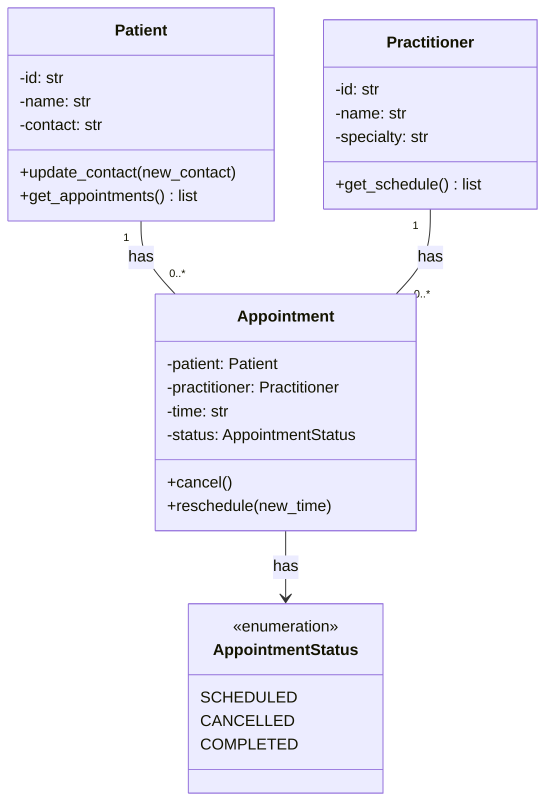

# SmartCare Domain Implementation v0.4

## 1. UML-to-Code Trace

| UML element | Python element | Implemented? | Notes |
|---|---|---|---|
| Patient class | `Patient` | Yes | Attributes id, name, contact; constructor validation added |
| Patient.update_contact() | `Patient.update_contact()` | Yes | Validates new contact is not empty |
| Patient.get_appointments() | `Patient.get_appointments()` | Yes | Returns list of appointments this patient has |
| Practitioner class | `Practitioner` | Yes | Attributes id, name, specialty; constructor validation added |
| Practitioner.get_schedule() | `Practitioner.get_schedule()` | Yes | Returns list of appointments this practitioner has |
| Appointment class | `Appointment` | Yes (pending AI review) | Implemented via AI pair-programming, see Section 4 |
| Appointment.cancel() | `Appointment.cancel()` | Yes (pending AI review) | Enforces status transition rule |
| Appointment.reschedule() | `Appointment.reschedule()` | Yes (pending AI review) | Only allowed while status is SCHEDULED |
| Appointment status attribute | `AppointmentStatus` enum | Yes | Added beyond original UML — string status replaced with enum for safety (see Section 5) |

## 2. Domain Invariants

| Class | Invariant / rule | How protected |
|---|---|---|
| Patient | id, name, contact must never be empty | Checked in `__init__` and `update_contact()`; raises ValueError otherwise |
| Practitioner | id, name, specialty must never be empty | Checked in `__init__`; raises ValueError otherwise |
| Appointment | time must never be empty | Checked in `__init__` and `reschedule()` |
| Appointment | status can only move SCHEDULED → CANCELLED, never backwards or from CANCELLED/COMPLETED | Enforced inside `cancel()` and `reschedule()`, which check current status before changing it; raises InvalidTransitionError otherwise |
| Appointment | status is never set directly from outside the class | No public setter for status — only exposed via `cancel()`/`reschedule()` methods and a read-only `status` property |

## 3. Composition / Inheritance Decisions

| Relationship | Decision | Rationale |
|---|---|---|
| Patient ↔ Appointment | Association | Patient exists independently of any appointment; Appointment holds a reference, not ownership |
| Practitioner ↔ Appointment | Association | Same reasoning — a Practitioner's lifecycle isn't tied to any single appointment |
| Appointment → AppointmentStatus | Composition (has-a, tightly coupled) | An Appointment cannot exist meaningfully without a status; the enum only exists in service of Appointment |
| Appointment class hierarchy | No inheritance used | Appointment is not a specialised version of anything else in this model; nothing justified an "is-a" relationship |
| Patient/Practitioner class hierarchy | No inheritance used | Both are standalone concepts with no shared base class needed at this scope |

## 4. AI Pair-Programming Record

**Prompt used (Part D):**
Act as a Python pair programmer. Implement only the Appointment class
from the approved SmartCare UML. Use type hints and an
AppointmentStatus enum. Cancelled appointments remain as objects. Do not
add database, UI, notification or service classes. Protect status
transitions and explain any decision not directly visible in the UML.

**AI-generated contribution:**

Copilot returned an `AppointmentStatus` enum (BOOKED/CANCELLED/COMPLETED)
and an `Appointment` implemented as a `@dataclass` with public fields
for `status` and `time`, plus `cancel()`, `complete()`, and
`reschedule()` methods. It explained several decisions not shown in the
UML: completed appointments cannot be cancelled or rescheduled,
cancelled appointments cannot be completed or rescheduled, repeated
cancellation is silently ignored rather than raising an error, and the
class stores `patient_id`/`practitioner_id` as strings rather than full
object references.

| AI contribution | Conforms? | Decision | Reason | Verification |
|---|---|---|---|---|
| AppointmentStatus enum (closed set of statuses) | Yes | Accepted | Matches FR-10's requirement for a defined status set; makes the model testable | Confirmed enum values map to FR-10's examples |
| `@dataclass` with public `status`/`time` fields | No | Rejected | Public fields let any caller set `appointment.status = ...` directly, bypassing `cancel()`/`reschedule()` entirely — breaks the invariant in Section 2 that status may only change through those methods | Wrote a private-field + property version and confirmed direct assignment is no longer possible |
| Stores `patient_id`/`practitioner_id` as strings | No | Rejected | Doesn't match the approved model, where Patient/Practitioner objects register their own appointments (`add_appointment()`, `get_appointments()`, `get_schedule()`); string IDs would break that integration | Kept object references as originally modelled in v0.3/v0.4 |
| `complete()` method for a COMPLETED status | Yes | Accepted | Reasonable, well-justified addition — completes the FR-10 status set without violating any constraint in the prompt | Added to the final Appointment class and tested manually (Part F) |
| Repeated cancellation silently ignored | No | Modified | Inconsistent with Part F's instruction to test "an illegal repeated transition" — that implies it should be caught as an error, not swallowed silently | Raises `InvalidTransitionError` instead, and this was verified by manually calling `cancel()` twice |
| Generic `ValueError` used for all domain-rule violations | No | Modified | Makes it impossible for calling code to distinguish "illegal state transition" from "bad input value" | Introduced a dedicated `InvalidTransitionError` exception, used only for transition rule violations |
| BOOKED as the initial status name | No | Modified | Inconsistent with SCHEDULED already used across the rest of the v0.3/v0.4 model | Renamed to SCHEDULED to match the established naming |

## 5. Updated UML

The only change from the v0.3 UML is that Appointment's `status`
attribute is now typed as an `AppointmentStatus` enum (SCHEDULED,
CANCELLED, COMPLETED) rather than a plain string. This was not shown
explicitly in the v0.3 diagram but is a direct implementation of FR-10
("record the status of each appointment") in a way that prevents
invalid status values (e.g. typos) that a raw string would allow. No
other structural changes were made — Patient, Practitioner, and their
relationships to Appointment remain as originally modelled.

## Reflection

The part I rejected outright was the public, directly-mutable `status`
and `time` fields from the `@dataclass` implementation. This was the
single biggest issue — it recreated exactly the "public state mutation"
problem flagged as a design flaw in this week's tutorial activity, and
it would have let any calling code bypass `cancel()`/`reschedule()`
completely, breaking the whole point of protecting status transitions
that the prompt itself asked for. I also rejected representing
Patient/Practitioner as plain ID strings, since it didn't match the
association-based model already built in Patient and Practitioner
(which register and return their own Appointment objects).

I modified rather than fully rejected a few other things: the silent
handling of a repeated cancellation, and the use of a generic
`ValueError` for every domain error. Both were reasonable engineering
choices in isolation, but neither matched how Part F expects an illegal
transition to actually behave (as something explicitly caught and
raised, not silently ignored), so I introduced a dedicated
`InvalidTransitionError` and made repeated cancellation raise rather
than pass silently.

The approved design constrained the AI in a useful way: because the
domain invariants (Section 2) and existing Patient/Practitioner classes
already existed before this prompt was run, it was possible to check
every AI decision against something concrete rather than trusting it on
its own explanation. Where the AI's reasoning was sound (the enum, the
COMPLETED status, refusing transitions out of COMPLETED/CANCELLED), it
was accepted directly. Where it introduced a structural choice that
conflicted with the already-approved model — public mutability, ID-only
references — that's exactly the kind of thing evidence-based review is
meant to catch before it becomes technical debt.
